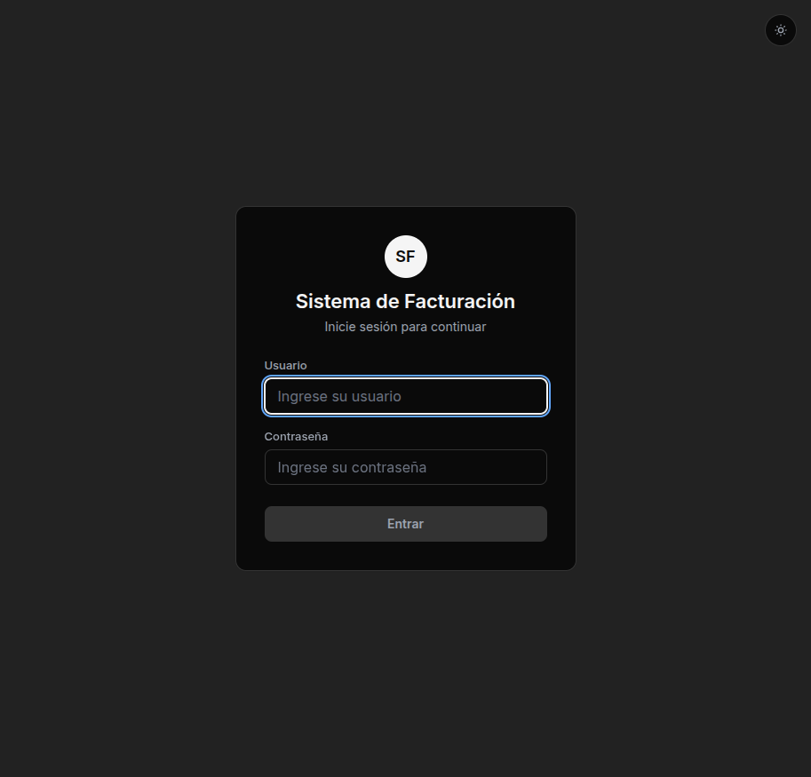
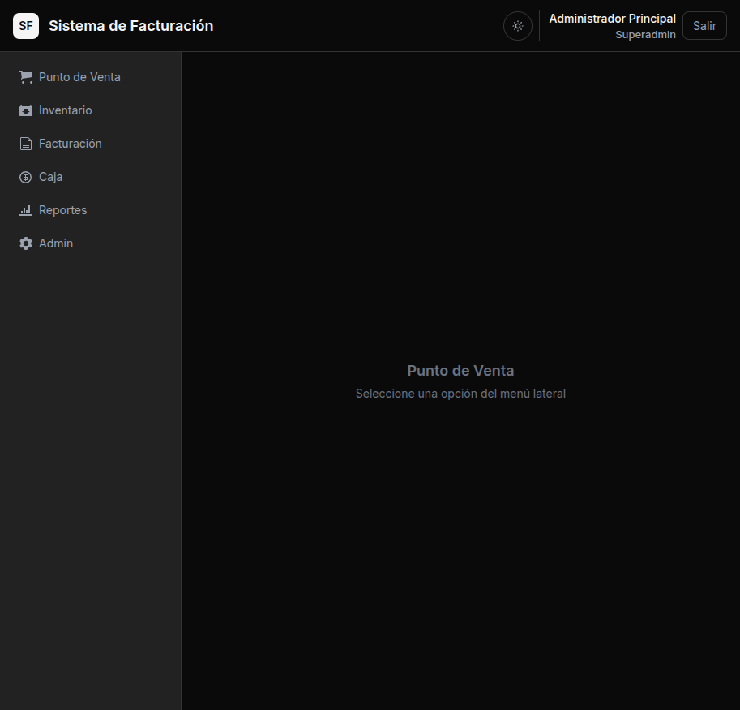
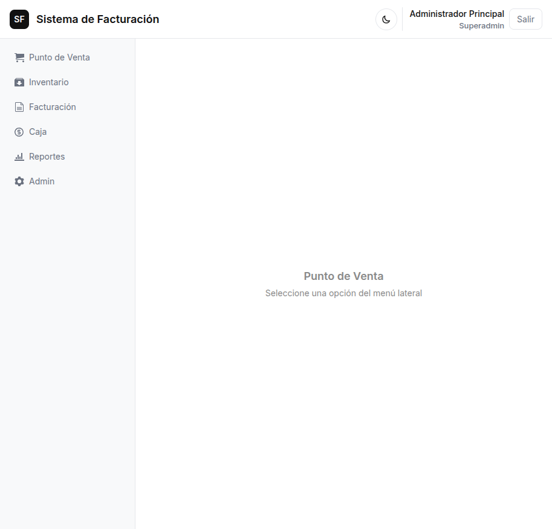

# 🧾 Sistema de Facturación — POS

Punto de venta (POS) y sistema de facturación para **PYME venezolana**. Offline-first, multiplataforma, con arquitectura de plugins y modelo open-core.

| Light mode | Dark mode |
|---|---|
|  |  |
|  |  |

> ⚡ Keyboard-first · 🎯 TDD · 🔌 Plugin system · 🇻🇪 Hecho en Venezuela

---

## Stack

| Capa | Tecnología |
|---|---|
| **Desktop** | Electron 32 + TypeScript 5.5 (strict) |
| **Frontend** | React 18 + TailwindCSS 3 + Atomic Design |
| **Database** | SQLite via Prisma 6 ORM (migratable a PostgreSQL) |
| **Testing** | Vitest + React Testing Library (TDD obligatorio) |
| **Build** | electron-vite + electron-builder |

## Arquitectura

```
┌─────────────────────────────────────────────┐
│              Renderer (React)               │
│  Screaming Architecture + Atomic Design     │
├─────────────────────────────────────────────┤
│                   IPC Bridge                │
├─────────────────────────────────────────────┤
│              Main Process (Node)            │
│  ┌──────────┐  ┌──────────┐  ┌──────────┐  │
│  │  Core    │  │   Infra  │  │  Plugins │  │
│  │ Entities │  │ Prisma   │  │  Loader  │  │
│  │ UseCases │  │ Printer  │  │ Licenses │  │
│  │  Ports   │  │ USD Rate │  │   Hooks  │  │
│  └──────────┘  └──────────┘  └──────────┘  │
└─────────────────────────────────────────────┘
```

## Open-Core

| Componente | Licencia | ¿Quién lo ve? |
|---|---|---|
| Core POS (este repo) | **MIT** | Público |
| `plugin-api/` | **MIT** | Público — cualquiera puede construir plugins |
| License Manager | **MIT** | Público (código auditable) |
| Plugins premium | Privado | Solo con licencia |
| Backend de licencias | Privado | Solo el equipo |

**Tiers de features:**

| Tier | Ejemplos |
|---|---|
| 🆓 Free | POS, inventario, tasa USD, multi-usuario |
| ⭐ Premium | Impresora fiscal, módulo restaurante |
| 🏢 Enterprise | SENIAT, multi-terminal |

## Getting Started

```bash
# 1. Clonar
git clone git@github.com:juanvs23/coltman-sistema-de-facturacion.git
cd coltman-sistema-de-facturacion

# 2. Rama de trabajo
git checkout dev

# 3. Instalar
npm install

# 4. Generar Prisma client y crear DB
npx prisma generate
npx prisma db push

# 5. Seed de datos (opcional)
npm run prisma:seed

# 6. Iniciar desarrollo
npm run dev
```

**Seed — usuarios por defecto (solo desarrollo):**

| Usuario | Contraseña | Rol |
|---|---|---|
| `admin` | `admin123` | SUPERADMIN |
| `vendedor1` | `admin123` | SELLER |
| `vendedor2` | `admin123` | SELLER |

> ⚠️ **Advertencia**: estos usuarios se crean únicamente para desarrollo y pruebas. En producción, elimínelos o cambie todas las contraseñas inmediatamente después del primer despliegue. El proyecto no se hace responsable por accesos no autorizados derivados del uso de estas credenciales predeterminadas.

## Workflow

```
dev  →  (trabajo diario)  →  merge →  master  (producción)
```

- **Siempre trabajar en `dev`** — crear ramas desde `dev` para features
- **Commits**: convencionales (feat/fix/chore/docs)
- **Push a `dev`**: cuantas veces sea necesario
- **Merge a `master`**: solo cuando está probado y estable
- **TDD**: los tests se escriben antes que el código de implementación

## Estado del Proyecto

**v0.1.1** — En desarrollo activo. Próximas prioridades:

1. 🔲 Router de navegación (menú lateral)
2. 🔲 CRUD de productos
3. 🔲 Pantalla POS (carrito + cobro)
4. 🔲 Arqueo de caja
5. 🔲 Historial de ventas

Ver el [roadmap](docs/roadmap.md) (interno) y el [CHANGELOG](CHANGELOG.md).

## Plugins

Crea tu propio plugin para el POS:

```bash
npm install @sistema-facturacion/plugin-api
```

```ts
import { IPlugin, PluginManifest } from '@sistema-facturacion/plugin-api'

export default class MyPlugin implements IPlugin {
  manifest: PluginManifest = {
    id: 'my-plugin', name: 'My Plugin',
    version: '1.0.0', description: '...',
    author: 'Me', visibility: 'free',
    target: 'main', hooks: ['sale:completed']
  }
  async activate() { return { success: true } }
  async deactivate() { return { success: true } }
}
```

Documentación completa en [`plugin-api/`](plugin-api/README.md).

## Licencia

**MIT** — el core es 100% open source. Los plugins premium se distribuyen bajo licencia comercial separada.

---

<p align="center">🇻🇪 Hecho en Venezuela · Caracas</p>
